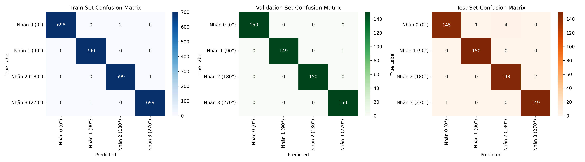

# A4 Document Rotation Detection & Correction

A Deep Learning-based supervised classification pipeline to detect and auto-correct document orientation ($0^\circ$, $90^\circ$, $180^\circ$, $270^\circ$) using ResNet18.

---
## 💾 Model Checkpoint

Due to Git file size limitations, the trained model weights are hosted on Google Drive.

* 📥 **Download Trained Weights (`best_rotnet_model.pth`):** [Download via Google Drive](https://drive.google.com/file/d/1W6vvsKuBHFEuX6YKELcBGD8KVjwg3076/view?usp=sharing)

## 📌 1. Project Overview & Methodology

* **Task Standard:** Supervised Image Classification (4 classes corresponding to rotation angles: $0^\circ$, $90^\circ$, $180^\circ$, and $270^\circ$).
* **Model Architecture:** ResNet18 (Pretrained on ImageNet).
* **Data Augmentation:** On-the-fly continuous 4-angle rotation via custom PyTorch `Dataset`, effectively expanding the training capability to $4,000$ instances.

---

## 📦 2. Dataset Strategy & Stratified Split

To ensure robustness, **1,000 original upright documents** were curated across 4 distinct real-world document categories:

| Sub-category | Description / Source | Original Count |
| :--- | :--- | :---: |
| **Scan** | Flatbed scanned documents (DocVQA) | 250 |
| **Receipt** | Receipts & Invoices (CORD-v2) | 250 |
| **Handwritten** | Full-page handwritten forms (IAM Handwritten Dataset) | 250 |
| **Captured** | CamScanner / Mobile camera captures (SmartDoc) | 250 |
| **Total** | **Diverse multi-source document dataset** | **1,000** |

### Stratified Data Splitting
Using `train_test_split` with a ratio of **70% Train - 15% Validation - 15% Test**, we maintain an identical sub-category class distribution across all three splits:

* **Train Set (70%):** 700 original images ($2,800$ rotated samples)
* **Val Set (15%):** 150 original images ($600$ rotated samples)
* **Test Set (15%):** 150 original images ($600$ rotated samples)

---

## 📊 3. Performance & Evaluation Metrics

### Comprehensive Performance Summary

| Dataset Split | Accuracy | Macro Precision | Macro Recall | Macro F1-Score |
| :--- | :---: | :---: | :---: | :---: |
| **Train Set** | 99.82% | 0.9982 | 0.9982 | 0.9982 |
| **Validation Set** | 98.67% | 0.9868 | 0.9867 | 0.9867 |
| **Test Set** | **98.33%** | **0.9835** | **0.9833** | **0.9833** |

### Confusion Matrices
All 3 splits (Train, Val, Test) show consistent confusion matrix distributions without severe overfitting:



### Error & Misclassification Analysis
* **Square/Symmetric Artifacts:** A small minority of errors occurred on near-square documents or sparse receipts where vertical text orientation cues are ambiguous.
* **Handwritten Scrawls:** Documents containing only non-linear hand sketches or single-line handwritten signatures lack strong top-to-bottom reading gravity.

---

## 🚀 4. How to Run

### Installation
```bash
git clone [https://github.com/your-username/a4-document-rotation.git](https://github.com/your-username/a4-document-rotation.git)
cd a4-document-rotation
pip install -r requirements.txt
