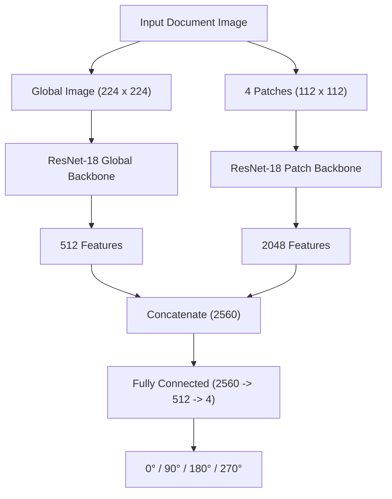

# Document Orientation Classification

A deep learning pipeline for document orientation prediction ($0^\circ, 90^\circ, 180^\circ, 270^\circ$) using a parallel dual-stream **Multi-Scale Fusion ResNet** architecture.

---

## Dataset


Instead of relying solely on standard academic papers (e.g., arXiv), the system utilizes a diverse dataset aggregated from multiple real-world document sources (>43,000 raw images):
* **SROIE (`sroie-datasetv2`)**: Scanned receipts containing various fonts, thermal paper noise, and irregular layouts.
* **CORD (`cord-1000`)**: Consolidated receipt datasets with complex background elements and distorted text alignment.
* **Receipt Dataset (`receiptdatasetssd300v2`)**: Commercial receipts with varying lighting conditions and physical folds.
* **RVL-CDIP (`the-rvlcdip-dataset-test`)**: Diverse document types including letters, forms, invoices, and reports.

### Dataset Pipeline
1. **Sampling**: 2,500 raw document images were randomly selected from the combined dataset pool.
2. **Augmentation**: Each image was rotated by $0^\circ, 90^\circ, 180^\circ,$ and $270^\circ$, generating a balanced dataset of **10,000 images**.
3. **Data Splitting**: Group-based stratified splitting ($8:1:1$) was applied to ensure all rotated variants of the same document reside within the same split:
   * **Train**: 8,000 images
   * **Validation**: 1,000 images
   * **Fixed Test**: 1,000 images

### Training Setup & Hyperparameters
Based on prior experimentation, the optimal setup for this classification task utilizes a **ResNet-18** backbone configured with the following parameters:
* **Optimizer**: AdamW ($\text{Learning Rate} = 10^{-4}$, $\text{Weight Decay} = 10^{-2}$)
* **Loss Function**: CrossEntropyLoss
* **Data Augmentations**:
  * `ColorJitter`: Brightness = $0.2$, Contrast = $0.2$
  * `RandomRotation`: Degrees = $\pm20^\circ$

---

## Proposed Methodology

A patch-based dual-stream pipeline is introduced to extract both macro-level layout structures and micro-level textual features:

1. **Dual Inputs**: Two separate inputs are generated from a single document image: the full global image and 4 localized center patches.
2. **Global Stream**: The full page image ($224 \times 224$) passes through a ResNet-18 backbone to learn macro-level structural characteristics (page borders, whitespace margins, title positioning, layout geometry) and extracts **512 features**.
3. **Patch Stream**: The 4 center patches ($112 \times 112$ each) pass through an independent ResNet-18 backbone to capture micro-level local features (text line orientation, character alignments, diacritics/accents) and extract **2048 features** ($4 \times 512$).
4. **Feature Fusion**: Both backbones operate completely in parallel. The extracted feature maps are concatenated into a unified **2560-dimensional vector**.
5. **Classification**: The classifier receives the 2560 fused features, combining global structure with local textual cues to classify the orientation class.

### Architecture Diagram



## Evaluation

### Performance Metrics

| Metric | Accuracy |
| :--- | :---: |
| **Train Accuracy** | $93.1\%$ |
| **Validation Accuracy** | $91.8\%$ |
| **Test Accuracy (Fixed Test Set)** | **$91.5\%$** |

The proposed method achieves **$91.5\%$ accuracy** on the unstandardized real-world document test set. Convergence is fast and stable within 5 epochs, demonstrating strong generalization without overfitting.

---

## How to Run

### Installation

Install the required dependencies:

```bash
pip install -r requirements.txt
```
### Inference
Run the prediction on any document image using pre-trained weights:
```bash
python predict.py --image path/to/document.jpg --weights weights/best_multiscale_fusion.pth
```

